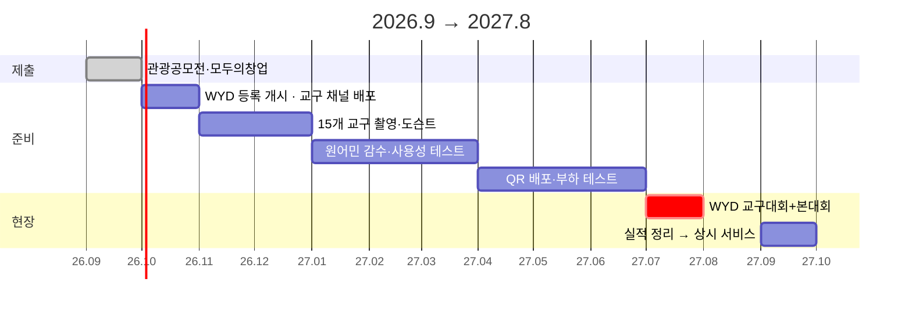

# ⛪ Visit Holy Korea — 세계청년대회 2027, 외국 순례자를 위한 한국 성지 안내 웹앱

> 2027년 8월 서울에서 열리는 **세계청년대회(WYD)** 에 오는 수십만 외국 청년이, 자기 나라 말로 한국의 성지·성당을 이해하고 찾아가게 해주는 **6개 국어 순례 웹앱**.
> 앱 설치 없이 링크·QR 하나로 열리고, 성지 208곳 · 오디오 도슨트 · GPS 길찾기 · 방문 예절 · 주변 관광까지 한 화면에서.

**'모두의 창업' 2차** 사업계획서 · 마감 **2026-09-17(목) 16:00** · 지원 한도 3,000만 원 · 작성 2026-09-11

> ⚠️ 현재 상태: **무료 공개 베타 · 매출 0원 · 상용화 전 시제품.** 숫자마다 출처 링크와 확인일을 붙였다.

---

## 🔗 한눈에

| 무엇 | 값 | 어디서 확인 |
|---|---|---|
| **배포된 앱** | **<https://visitholykorea-app.vercel.app>** | 지금 열어 볼 수 있음 |
| **대회** | 2027.7.29~8.8 · 전국 15개 교구 + 서울 | [연합뉴스 2026-07-28](https://www.yna.co.kr/view/AKR20260728070600005) |
| **예상 참가** | 폐막 미사 **40~80만** (조직위) | [연합뉴스](https://www.yna.co.kr/view/AKR20260728070600005) |
| **직전 대회 실적** | 리스본 2023 등록 **35.4만 · 200개국+** | [Aleteia 2023-08-01](https://aleteia.org/2023/08/01/as-wyd-begins-one-new-record-is-reached/) |
| **리스본 경제효과** | 최소 **3.7억 유로**, 시 투자의 약 10배 | [ISEG 2024](https://www.iseg.ulisboa.pt/en/2024/06/jmj-lisbon-2023-economic-impact-assessment-report-now-available/) |
| **서울 경제효과** | 생산유발 **11조 3,698억** (KDI) | [뉴시스 2024-07-28](https://www.newsis.com/view/NISX20240728_0002828581) |
| **저희 언어 커버** | 리스본 상위 5개국 = 등록자 **68.4%** 전부 | 아래 §4-3 |
| **시제품** | 성지 208곳 · 영어 100% · 테스트 334개 통과 | 2026-09-11 실측 |

---

## 🌍 1. 2027년 8월, 한국에서 세계 최대 가톨릭 청년 행사가 열린다

**세계청년대회(World Youth Day)** — 교황이 직접 오는 전 세계 가톨릭 청년의 축제. 2~3년마다 대륙을 옮기며 남미·북미·유럽·아시아·중동·아프리카 **200개국 이상**이 모인다.

| 항목 | 2027 서울 | 출처 |
|---|---|---|
| **본대회** | **2027.8.3(화) ~ 8.8(일)** 서울 | [연합뉴스](https://www.yna.co.kr/view/AKR20260728070600005) |
| **교구대회** | **7.29 ~ 8.2** — 서울 제외 **전국 15개 교구**에서 먼저. 해외 순례자가 **지방 교회에 머물며** 한국 문화 체험 후 서울로 | [연합뉴스](https://www.yna.co.kr/view/AKR20260728070600005) · [아주경제 2026-08-17](https://www.ajunews.com/view/20260811173035410) |
| **교황** | 레오 14세 참석 — 2014년 이후 **13년 만의 교황 방한** | [연합뉴스](https://www.yna.co.kr/view/AKR20260728070600005) |
| **의미** | **아시아 두 번째**(1995 마닐라) · **비그리스도교 문화권 최초** | [아주경제](https://www.ajunews.com/view/20260811173035410) |
| **등록** | **2026년 10월** 개시 — 순례자 패키지 11종, 80~310달러 | [연합뉴스](https://www.yna.co.kr/view/AKR20260728070600005) · [헤럴드경제](https://biz.heraldcorp.com/article/10824762) |
| **숙박** | 본당·가정 **홈스테이 중심** → 순례자가 곳곳에 흩어져 **혼자 이동** | [연합뉴스](https://www.yna.co.kr/view/AKR20260728070600005) |

<b>역대 대회 규모 — "수십만"은 보수적인 숫자다</b>

| 연도 | 개최지 | 등록 순례자 | 폐막 미사 |
|---|---|---|---|
| 1995 | 마닐라 (아시아 첫 대회) | — | **500만** |
| 2011 | 마드리드 | — | 140~200만 |
| 2013 | 리우데자네이루 | — | 370만 |
| 2016 | 크라쿠프 | 35만+ (187개국) | 250~300만 |
| 2019 | 파나마 | — | 70만 (140개국) |
| 2023 | 리스본 | **35만 4천** (200개국+) | **150만** |
| **2027** | **서울** | 10월 등록 개시 | **40~80만 전망** |

출처: [Wikipedia — World Youth Day](https://en.wikipedia.org/wiki/World_Youth_Day) · [교황청 평신도부 — 파나마](https://www.laityfamilylife.va/content/laityfamilylife/en/news/2024/5--anniversario-della-gmg-di-panama-2019.html) · [Catholic Leader — 크라쿠프](https://catholicleader.com.au/culture/wyd-2016/wyd-pilgrims-leave-krakow-eager-to-be-missionaries-of-mercy/)

---

## 📊 2. 직전 대회 리스본 2023 — 실제로 얼마나 왔고, 얼마를 벌었나

### 2-1. 참가 실적

| 항목 | 실적 | 출처 |
|---|---|---|
| **등록 순례자** | **354,000명** | [Aleteia](https://aleteia.org/2023/08/01/as-wyd-begins-one-new-record-is-reached/) |
| **참가국** | **200개국+** — 몰디브 빼고 전 세계, 역대 최다 | [Aleteia](https://aleteia.org/2023/08/01/as-wyd-begins-one-new-record-is-reached/) |
| **폐막 미사** | **약 150만 명** | [Wikipedia](https://en.wikipedia.org/wiki/World_Youth_Day_2023) |
| **상위 5개국** | 스페인 77,224 · 이탈리아 59,469 · 포르투갈 43,742 · 프랑스 42,482 · 미국 19,196 | [Aleteia](https://aleteia.org/2023/08/01/as-wyd-begins-one-new-record-is-reached/) |
| 주교·추기경 | 688명 (추기경 30) | [Aleteia](https://aleteia.org/2023/08/01/as-wyd-begins-one-new-record-is-reached/) |
| 봉사자 | 25,000명 | [Aleteia](https://aleteia.org/2023/08/01/as-wyd-begins-one-new-record-is-reached/) |
| **홈스테이** | 가정 **8,831곳** → 순례자 **28,618명** | [Aleteia](https://aleteia.org/2023/08/01/as-wyd-begins-one-new-record-is-reached/) |
| 공공시설 숙소 | 1,626곳 → 294,151명 | [Aleteia](https://aleteia.org/2023/08/01/as-wyd-begins-one-new-record-is-reached/) |
| **식사** | **270만 끼**, 참여 업소 1,800곳 | [Aleteia](https://aleteia.org/2023/08/01/as-wyd-begins-one-new-record-is-reached/) |

### 2-2. 포르투갈 경제에 미친 효과

| 구분 | 수치 | 출처 |
|---|---|---|
| 사전 예측 (PwC·ISEG) | 부가가치 **4.1~5.6억 유로** · 생산 **8.1~11억 유로** | [JMJ 공식](https://www.lisboa2023.org/pt/artigo/pwc-portugal-divulga-impacto-da-jmj-na-economia-nacional) · [ECCLESIA](https://agencia.ecclesia.pt/portal/jmj-2023-estudo-projeta-impacto-de-pelo-menos-411-milhoes-de-euros-em-valor-acrescentado-bruto-na-economia-portuguesa/) |
| **사후 평가** (ISEG 2024) | 단기 경제활동 **최소 3.7억 유로** — 2023년 3.1억, 리스본 지역 2.9억 | [Jornal Económico](https://jornaleconomico.sapo.pt/noticias/jmj-com-impacto-de-370-milhoes-na-economia-portuguesa-revela-iseg/) · [ISEG 보고서 PDF](https://www.iseg.ulisboa.pt/wp-content/uploads/Relatorio-ISEG_JMJ.pdf) |
| 사후 투입산출 (2024.4) | 부가가치 **4.35~5.5억 유로** | [ISEG](https://www.iseg.ulisboa.pt/en/2024/06/jmj-lisbon-2023-economic-impact-assessment-report-now-available/) |
| 리스본시 투자 | 3,500만 유로 | [ECO News](https://econews.pt/2023/01/26/lisbon-to-invest-e35m-in-world-youth-day-preparation-implementation/) |
| 조직 재단 결산 | **흑자 3,500만 유로** → 청년 지원 재단 | [ECCLESIA](https://agencia.ecclesia.pt/portal/lisboa-2023-fundacao-jmj-apresenta-saldo-positivo-de-35-milhoes-de-euros/) · [The Pillar](https://www.pillarcatholic.com/p/wyd-lisbons-unlikely-surplus-launches) |

> **한 줄** — 리스본시가 3,500만 유로를 넣어 경제에 최소 3.7억 유로(약 **10배**)가 돌아왔고, 조직위는 흑자를 냈다.

### 2-3. 관광으로 이어진 파생 효과

| 항목 | 수치 | 출처 |
|---|---|---|
| **2023년 8월 포르투갈 숙박** | **1,050만 박 — 사상 최고** | [Portugal Resident](https://www.portugalresident.com/tourism-hits-record-high-in-august-with-10-5-million-overnight-stays/) |
| 외국인 숙박 | 660만 박, **+6.4%** | [Portugal Resident](https://www.portugalresident.com/tourism-hits-record-high-in-august-with-10-5-million-overnight-stays/) |
| 2019년 8월 대비 | 투숙객 **+6.3%** · 숙박 +4.9% | [INE 포르투갈 통계청](https://www.ine.pt/xportal/xmain?xpid=INE&xpgid=ine_destaques&DESTAQUESdest_boui=646074543&DESTAQUESmodo=2) |
| 연간 | 2019년 초과 — **WYD를 요인으로 명시** | [CaixaBank Research](https://www.caixabankresearch.com/en/sectoral-analysis/tourism/tourism-portugal-2023-recap-and-2024-so-far) · [Portugal News](https://www.theportugalnews.com/news/2023-09-29/record-breaking-tourism-results/81856) |

> **의미** — 순례자는 미사만 보고 가지 않는다. 숙박·식사·이동·지역 방문이 따라오고, 그 달이 그 나라 관광 기록을 갈아치웠다.

---

## 🇰🇷 3. 서울 2027 — 얼마나 올 것으로 보는가 (국내 기사)

| 전망 | 내용 | 출처 |
|---|---|---|
| **조직위 (2026.7)** | 폐막 미사 기준 **40만~50만 / 70만~80만** | [연합뉴스 2026-07-28](https://www.yna.co.kr/view/AKR20260728070600005) |
| 조직위 D-365 공식 | "수십만 명" — 등록 전이라 보수적 | [아주경제 2026-08-17](https://www.ajunews.com/view/20260811173035410) |
| 일부 보도 | 최대 100만 | [뉴스토마토](https://www.newstomato.com/readnews.aspx?no=1242641) · [뉴시스](https://www.newsis.com/view/NISX20240728_0002828581) |
| **경제효과 (KDI)** | 생산유발 **11조 3,698억** · 부가가치 **1조 5,908억** · 고용 **2만 4,725명** | [뉴시스](https://www.newsis.com/view/NISX20240728_0002828581) · [문화일보](https://www.munhwa.com/article/11444072) · [가톨릭신문](https://www.catholictimes.org/article/20240729500004) · [EBS](https://news.ebs.co.kr/ebsnews/allView/60503432/N) |
| 중장기 | **추가 관광 수요**, 국가 브랜드 제고 | [가톨릭신문](https://www.catholictimes.org/article/20240729500004) |
| 지역 | 제주 등 각 교구가 교구대회로 "지역 관광·문화를 세계에" | [제주일보](https://www.jejunews.com/news/articleView.html?idxno=2216486) |
| 봉사자 | 3만 명 | [연합뉴스](https://www.yna.co.kr/view/AKR20260728070600005) |

> **보수적으로 잡아도** — 조직위 하한 40만에 리스본의 외국인 비율(등록자의 88%)을 적용하면 **수십만 외국인이 8월 한 달 한국에 머문다.** 그중 상당수가 교구대회 5일간 **지방 15개 교구**에 있다.

---

## 📱 4. Visit Holy Korea — 성지를 찾고, 관광으로 잇는 방법

### 4-1. 외국 순례자가 부딪힐 문제

- 성지 208곳의 역사·예절·미사 시간·가는 길이 **한국어로, 교구·본당별로 흩어져** 있다 — 영어 통합 안내 없음
- 교구대회 5일은 **지방**이다 — 대전·안동·광주·제주… 외국어 안내가 서울보다 훨씬 얇다
- 홈스테이 = **혼자 대중교통으로** 움직인다 (리스본 가정 8,831곳 → 28,618명)
- 순교터·묘역·미사 중 성당의 **예절**을 모르면 실례 — 알려주는 곳이 없다
- 열흘 머무는 방문객은 **앱을 안 깐다** → 링크·QR로 바로 열려야 쓴다

### 4-2. 순례자의 하루와 앱

### 4-3. 이미 만들어 배포 중인 기능 (2026-09-11 실측)

| 순례자의 순간 | 앱이 하는 것 | 상태 |
|---|---|---|
| **지방 교구에 도착** | GPS로 가까운 성지를 자기 언어로 목록 | ✅ 2026-09-08 |
| **이름만 아는 성지** | 6개 국어(한·영·스·프·포·이) 검색, 로마자 주소 병기 | ✅ 화면 문구 300키 |
| **가는 길** | 카카오·네이버·티맵·구글 지도 중 골라 길찾기 | ✅ |
| **문 앞에서** | 방문 예절 — 미사 중 입장·복장·사진 | ✅ |
| **성지 안에서** | 오디오 도슨트 7챕터, 한·영·스페인어 | ✅ 13곳 / 🚧 208곳 |
| **궁금한 것** | AI 가이드 — 성지 DB 안에서만 답하고 모르면 모른다고 | ✅ |
| **숙소 근처 미사** | 반경 5km 본당·공소 **5,918건** 로마자 표기 | ✅ 2026-09-08 |
| **성지 주변** | 한국관광공사 실시간 맛집·숙박·볼거리·축제 (저장 안 함) | ✅ |
| **다녀온 뒤** | 순례 스탬프 · 사진 · 다음 순례자에게 한 줄 | ✅ |
| **어떤 기기든** | 휴대폰·태블릿·PC 자동 전환, 설치 없음 | ✅ 2026-09-07 |
| **나이 든 순례자** | 큰 글자 · TTS · 속도 조절 | ✅ |
| **사진** | 성지 대표 사진 | 🚧 53/208 |

### 4-4. 핵심 근거 — 저희 언어가 리스본 상위 5개국을 전부 덮는다

| 순위 | 국가 | 등록 순례자 | 언어 | 앱 |
|---|---|---|---|---|
| 1 | 🇪🇸 스페인 | 77,224 | 스페인어 | ✅ |
| 2 | 🇮🇹 이탈리아 | 59,469 | 이탈리아어 | ✅ |
| 3 | 🇵🇹 포르투갈 | 43,742 | 포르투갈어 | ✅ |
| 4 | 🇫🇷 프랑스 | 42,482 | 프랑스어 | ✅ |
| 5 | 🇺🇸 미국 | 19,196 | 영어 | ✅ |
| | **합계** | **242,113** | **등록자의 68.4%** | **전부** |

출처: [Aleteia 2023-08-01](https://aleteia.org/2023/08/01/as-wyd-begins-one-new-record-is-reached/) · 242,113 ÷ 354,000 = 68.4%
서울 대회는 아시아(필리핀·일본·베트남·인도네시아) 비중이 오르고 그쪽 공통어는 **영어** — 이미 208곳 전부 번역 완료.

### 4-5. 성지 방문이 관광으로 이어지는 길

| 연결 | 앱의 기능 |
|---|---|
| **성지 → 주변** | 성지 상세에서 반경 5km 맛집·숙박·볼거리를 실시간으로 (한국관광공사 데이터) |
| **성지 → 축제** | 「축제 가는 김에」 — 오늘 열리는 지역 축제 옆 성지를 묶어 권함 |
| **붐빔 → 분산** | 「붐빔 피하기」 — 붐비는 관광지 대신 조용한 성지로 지방 분산 |
| **지자체 → QR** | `/region/대전` 같은 시·도 랜딩 — 지자체·교구가 QR 하나로 배포 |
| **15개 교구 = 15개 관광권** | 리스본 8월 숙박이 사상 최고였듯, 지방 성지 방문이 지역 숙박·식사로 |

---

## ⚠️ 5. 정직하게 — 약점과 대응

| 약점 | 사실 (2026-09-11) | 대응 |
|---|---|---|
| **외국인 수요 미측정** | 수요조사 20명 전원 한국인 (설명 부족 경험 100% · 해설 수요 60%) | 9/14~17 인천 국제준비회의 담당자 250명 인터뷰 시도 |
| **사진 155곳 없음** | 53/208 · 무료 출처 소진 | 관리자 콘솔로 현장 촬영 즉시 등록 · 지원금 1순위 |
| **실사용자 4명** | 가입 5(테스트 제외 4) · 스탬프 6 — DB 실측 | WYD 등록(10월)에 맞춰 교구 채널 배포 |
| **도슨트 13곳** | 208곳 중 6% | 교구대회 15개 교구 대표 성지부터 |
| **공식 승인 없음** | 조직위·교구 협약 0건 | 승인 전 "비공식 안내" 명시 |

---

## 💰 6. 자금 3,000만 원 — 코드가 아니라 현장에 쓴다

| 항목 | 내용 | 금액 | 비중 |
|---|---|---:|---:|
| **현장 사진 촬영** | 교구대회 개최지 우선 80곳 | 1,000만 | 33% |
| **도슨트 확대** | 15개 교구 대표 성지 15곳 원고·번역·녹음 | 600만 | 20% |
| **다국어 감수** | 스페인어·영어 원어민 검수 | 500만 | 17% |
| 외국인 사용성 검증 | WYD 참가 예정자 테스트 3회 | 300만 | 10% |
| 운영 기반 | 호스팅·지도·TTS 1년 | 300만 | 10% |
| QR 안내물 | 교구·본당 배포용 | 200만 | 7% |
| 예비 | 저작권·계약 검토 | 100만 | 3% |
| **합계** | | **3,000만** | **100%** |

---

## 📅 7. 일정 — WYD가 납기다

| 시기 | 할 일 | 확인 기준 |
|---|---|---|
| 2026.10 | WYD 등록 개시에 맞춰 교구 채널 배포 · 외국인 테스터 모집 | 외국인 테스터 10명 |
| 2026.11~12 | 15개 교구 대표 성지 촬영·도슨트 | 사진 +80곳 · 도슨트 28곳 |
| 2027.1~3 | 원어민 감수 · 사용성 테스트 · 교구 협의 | 협약 1곳 이상 |
| 2027.4~6 | QR 안내물 배포 · 동시 접속 부하 테스트 | 동시 1만 대응 |
| **2027.7.29~8.8** | **현장 운영** | 언어별 이용 완료율 · 오류 수정 시간 |
| 2027.9~ | 실적 정리 → 상시 순례 안내 서비스 | 다음 시즌 계약 |

---

## 🔴 사장님이 채울 것

| 항목 | 내용 |
|---|---|
| **수익 모델** | 직접 작성 (2026-09-11 지시) |
| **팀** | 최성빈 님(반응형 UI) 표기 여부 · 코딧세이 소속 표기 여부 |
| **트랙** | 로컬(지역 자원 활용, 2,000명) vs 일반·기술(8,000명) |
| **첨부 이미지** | 순례 여권·별자리·순례자 이야기 폰 캡처 3장 · 반응형 데스크톱 캡처 1장 |

제출 전 확인

- [ ] 10월 등록 개시 후 공식 등록 숫자 나오면 §3 갱신
- [ ] 모두의창업 공고 원문의 "상용화 서비스 제한" 재대조 (신청 페이지는 로그인 필요, 2026-09-11)
- [ ] 첨부 이미지 10장 확정

