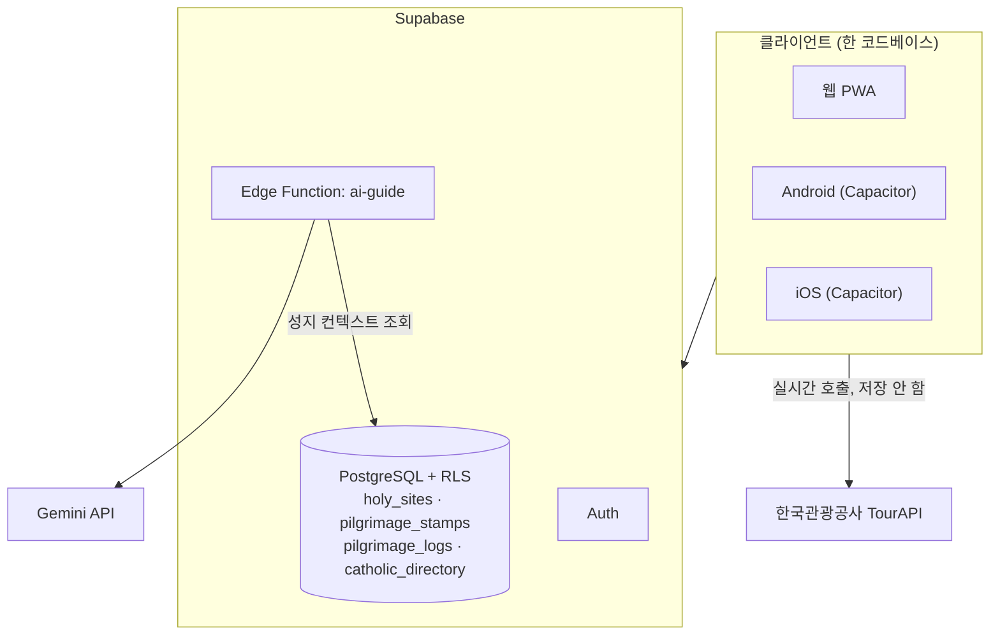

# 시스템 구조

## 전체 그림



Capacitor 는 같은 `dist/` 결과물을 네이티브 웹뷰에 담을 뿐이라, 화면 코드를 플랫폼별로 나누지 않는다.
플랫폼 차이는 CSS 안전영역(`safe-area-inset-*`)과 Supabase 세션 처리 정도에서만 다룬다.

## 레이어

```
pages      라우트 단위 화면. 여러 feature 를 조립하는 것이 일이다.
  ↓
features   도메인 단위. 각각 api / hooks / components 를 갖는다.
  ↓
shared     어느 도메인에도 속하지 않는 것 — supabase·tourapi 클라이언트, 타입, 유틸, 공통 UI, i18n
```

역방향 import(`shared` 가 `features` 를 부르는 등)는 금지한다.
`features` 끼리는 원칙적으로 참조하지 않지만, 도메인상 자연스러운 경우만 예외로 둔다
(예: `courses` 가 `sites` 의 조회 함수를 쓴다).

## 데이터 흐름 두 갈래

**우리 데이터 (holy_sites)** — 직접 수집·큐레이션한 자산이다.
자유롭게 저장·캐싱하며, 오프라인 대비 서비스워커 캐시 대상이기도 하다.
산간 성지가 많아 통신이 불안정한 환경을 전제한다.

**남의 데이터 (TourAPI)** — 매 요청 실시간 호출하고 절대 저장하지 않는다.
서비스워커 런타임 캐시에서도 제외한다. 배경은 `adr/0002-tourapi-usage.md`.

## 상태 관리

| 상태 종류               | 도구                   | 위치                                 |
| ----------------------- | ---------------------- | ------------------------------------ |
| 서버 데이터             | TanStack Query         | `features/*/hooks`                   |
| 화면 로컬 상태          | `useState`             | 해당 컴포넌트                        |
| 앱 설정(언어·글자 크기) | Context + localStorage | `shared/i18n/settings-context.tsx`   |
| 로그인 세션             | Supabase Auth 구독     | `features/auth/hooks/use-session.ts` |

전역 상태 라이브러리(Redux 등)는 쓰지 않는다. 서버 데이터가 대부분이고 그건 Query 가 맡는다.

## 보안

- 브라우저에는 Supabase anon 키만 나간다. 데이터 보호는 전적으로 RLS 정책이 한다.
- `holy_sites` 는 전체 공개 읽기, 쓰기는 service_role 만 가능하다(insert/update 정책 없음).
- `pilgrimage_stamps` · `pilgrimage_logs` 는 `auth.uid() = user_id` 로 본인 것만 접근 가능하다.
- Gemini 키는 Edge Function 시크릿으로만 존재하고 클라이언트 번들에 들어가지 않는다.

## 아직 안 된 것

| 영역                 | 현재 상태                                                                             |
| -------------------- | ------------------------------------------------------------------------------------- |
| 지도                 | 실제 지도 렌더링 미연동. 좌표 확보 성지 목록으로 대체 중 (`adr/0003-map-provider.md`) |
| 성지 좌표            | 상당수 미확보. 좌표가 없으면 코스 페어링·주변 정보·행사 조회가 모두 동작하지 않는다   |
| 성지 사진            | 미확보 다수. 없으면 ⛪ 이모지로 대체 표시                                             |
| 여행기 작성          | 읽기만 구현. 작성 화면 미구현                                                         |
| 즐겨찾기             | 버튼만 있고 동작하지 않음                                                             |
| `catholic_directory` | 스키마만 있고 앱에서 아직 읽지 않는다 (5,918건 적재는 별도 작업)                      |
| AI 가이드            | 코드는 완성. Edge Function 배포와 `GEMINI_API_KEY` 설정이 남았다                      |

## 두 데이터 테이블을 나눈 이유

`holy_sites`(208곳)는 추천 엔진이 쓰는 큐레이션 데이터고, `catholic_directory`(5,918건)는
CBCK 공식 주소록을 그대로 담은 참조 데이터다. 본당·공소·복지기관까지 `holy_sites` 에 섞으면
"쉼표 순례길"이 추천할 후보가 순식간에 오염되기 때문에 의도적으로 분리했다.
